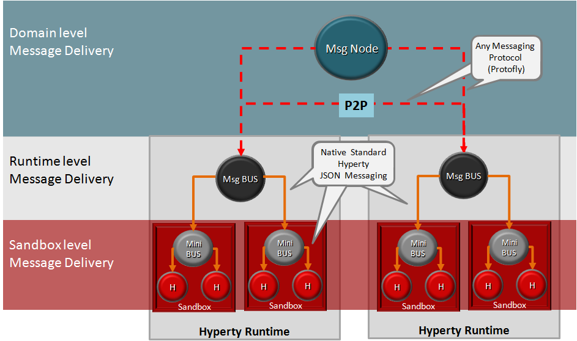
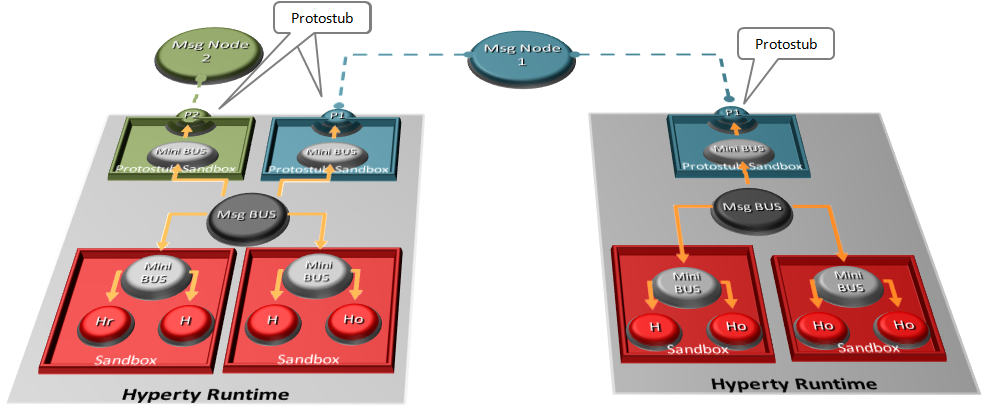

 "These Tutorials are for Phase 1!! Most updated version is [here](https://github.com/reTHINK-project/specs/tree/master/tutorials)" 
=============== 
Hyperty Messaging Framework
---------------------------

This document gives an overview on the Messaging Framework technical solution used to support Hyperty's interaction through the higher level [Data Synchronisation Reporter - Observer communication mechanism](p2p-data-sync.md). Check [the Hyperty Development Tutorial](development-of-hyperties.md) for more details.

Hyperties cooperate each other with a Resource Oriented Messaging model implemented by a simple Messaging Framework. The Hyperty Messaging Framework, supports different messaging patterns including publish/subscribe and request/response messaging patterns. The higher level [Reporter - Observer communication pattern](p2p-data-sync.md) works on top of these basic messaging patterns. It should be noted, that [Hyperty Service Development Framework](development-of-hyperties.md) to be used to create new Hyperties, abstracts Developers from the Hyperty Messaging Framework described in this document, including lower level Hyperty Messaging APIs.

The Message delivery is based on a simple message Router functionality that performs a lookup for listeners registered to receive the Message (the ["Message.to" Header field](https://github.com/reTHINK-project/dev-service-framework/blob/develop/docs/datamodel/message/readme.md#to) is the only information looked up for). The Message is posted to all found listeners, which can be other Routers or end-points (Hyperties). Thus, the Hyperty Messaging Framework is comprised by a network of Routers where each Router only knows adjacent registered Routers or end-points.

Listeners are programmatically registered and unregistered by Routing Management functionalities, which decide the listeners to be added according to a higher level view of the Routing Network.

The Messaging Framework works at three layers:

At the Runtime Sandbox level where Hyperties are executing, message delivery is provided by the [MiniBUS component](https://github.com/reTHINK-project/dev-runtime-core/blob/master/src/bus/MiniBus.js).

At the Runtime level where Sandboxes are hosted (e.g. in a Browser or in a NodeJS instance), message delivery is provided by the [Message BUS component](https://github.com/reTHINK-project/dev-runtime-core/blob/master/src/bus/MessageBus.js), which is an extension of the MiniBUS.

At Domain Level, message delivery is provided by the Message Node functionality by using the [Protofly mechanism](#protocol-on-the-fly-protofly-and-protostubs), i.e. communication between Message BUS and Message Nodes and among Message Nodes are protocol agnostic. This also means that the Message Node can be provided by any Messaging solution as soon as there is a [Protostub available](#protocol-on-the-fly-protofly-and-protostubs). Currently, a [Vertx Message Node](https://github.com/reTHINK-project/dev-msg-node-vertx), a [Matrix Message Node](https://github.com/reTHINK-project/dev-msg-node-matrix) and a [NodeJS Message Node](https://github.com/reTHINK-project/dev-msg-node-nodejs) are provided. These are just reference implementations of Message Nodes and anyone is free to develop its own Message Node. Check the [Message Node and associated Protostub development tutorial](development-of-protostubs-and-msg-nodes.md) for more details.

At runtime level (MessageBUS and MiniBUS), it is used a standard CRUD based [JSON Message Model](../datamodel/message/readme.md), which is easily mapped into Restfull APIs.

### Protocol on-the-fly (protofly) and Protostubs

Protocol on-the-fly leverages the code on-demand support by Web runtimes (eg Javascript), to dynamically select, load and instantiate the most appropriate protocol stack during run-time. Such characteristic enables protocols to be selected at run-time and not at design time, enabling protocol interoperability among distributed services, promoting loosely coupled service architectures, optimising resources spent by avoiding the need to have Protocol Gateways in service's middleware as well as minimising standardisation efforts. The implementation of the protocol stack, e.g. in a javascript file, that is dynamically loaded and instantiated in run-time is called **Protostub:**. For security reasons, Protostubs are executed in isolated sandboxes and are only reachable through the Runtime MessageBUS and the Protostub Sandbox MiniBUS.

### Message Delivery between different Hyperty Runtimes

Communication between the Message BUS and Message Nodes are provided by a Protostub that implements the protocol stack used to interact with the Message Node e.g. JSON over Websockets or a Restfull API Client. Listeners of protostubs are registered in the MessageBUS for a set of Message recipient addresses, usually a Hyperty Domain like `domain://example.com`.

When the MessageBUS is processing a new message and looking up routing paths for an address (The Message Routing generic procedure is described [here](../specs/dynamic-view/basics/bus-msg-routing.md)), which is not local (eg `hyperty://example.com/alice-hyperty`), it won't find any registered listeners. In this case, the MessageBUS will ask the [Runtime Registry](https://github.com/reTHINK-project/dev-runtime-core/blob/d3.2-working-docs/docs/specs/readme.md#runtime-registry) to resolve the "Message.to" header field, which will look for registered Protostubs that are able to deliver messages to such non-local address. If there is already a deployed Protostub that is able to deliver the message to the remote Hyperty, the Registry will return the Hyperty Runtime protostub address and the MessageBUS will look up again for the protostub listener registered for its address. Otherwise, the [deployment of the required Protostub is performed](../spec/dynamic-view/basics/deploy-protostub.md) and as soon as the Protostub is successfully instantiated, its hyperty runtime address is returned.
